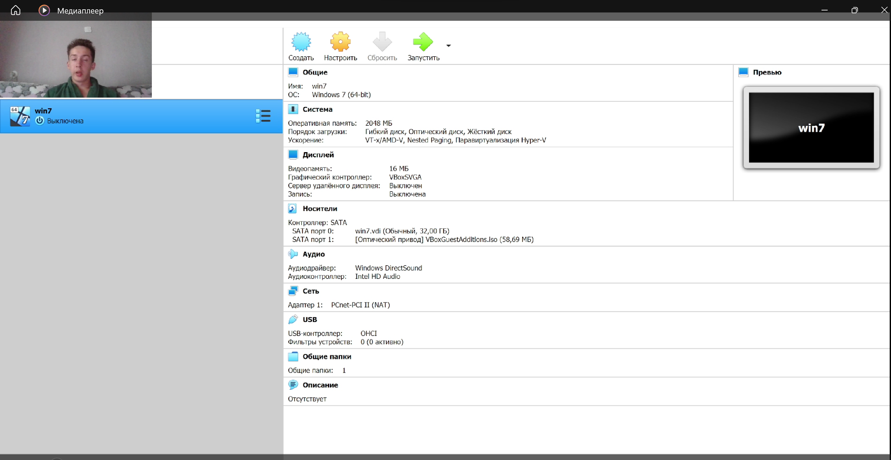

### РОССИЙСКИЙ УНИВЕРСИТЕТ ДРУЖБЫ НАРОДОВ
#### Факультет физико-математических и естественных наук  
#### Кафедра математического моделирования и искусственного интеллекта 
## ОТЧЕТ ПО ЛАБОРАТОРНОЙ РАБОТЕ № 1
#### Дисциплина: Информационная безопасность
##### Студент:  Дупленских Василий Викторович
##### Группа:   НБИбд-01-21
## Москва 2024
***

### Задание:
Лабораторная работа подразумевает установку на виртуальную машину VirtualBox

### Ход выполнения:
1. Установил virtual Box и запустил его
2. Настроил виртуальную машину
3. Запустил виртуальную машину и начал установку
4. Перешёл в сам установщик и настраивал будущую операционную систему
5. Авторизовался в установленной операционной системе и выполнил следующие команды для добавления нового пользователя и задания пароля
   * su - 
   * adduser -G wheel Username
   * passwd username
   * hostnamectl set-hostname username
    * hostnamectl
    * 
6. Я использовал команду dmesg | grep -i "то, что ищем"чтобы получить следующие данные:
   * Версия ядра Linux (Linux version).
    * Частота процессора (Detected Mhz processor).
    * Модель процессора (CPU0).
    * Объем доступной оперативной памяти (Memory available).
    * Тип обнаруженного гипервизора (Hypervisor detected).
  

  ### Выводы:
  Я создал виртуальную машину, запустил на ней и установил операционную систему centOS и немного разобрался в командах - а именно в конфигурации системы и устройства

### Ответы на вопросы:
1. Имя пользователя, пароль
2. 

### Получение справки по команде

**Команда:** `man <имя_команды>`

**Пример:** `man ls` (получить справку по команде `ls`)

**Другой вариант:** `help <имя_команды>` (доступен в некоторых оболочках)

### Перемещение по файловой системе

**Команда:** `cd <путь_к_каталогу>`

**Примеры:**

* `cd /home` (переход в корневой каталог домашнего пользователя)
* `cd ..` (переход на уровень выше)
* `cd Documents/` (переход в каталог Documents)

### Просмотр содержимого каталога

**Команда:** `ls`

**Примеры:**

* `ls -l` (вывести информацию о файлах и каталогах в подробном виде)
* `ls -a` (вывести скрытые файлы)
* `ls -h` (вывести размер файлов в удобном для чтения формате)

### Определение объёма каталога

**Команда:** `du -sh <путь_к_каталогу>`

**Пример:** `du -sh /home/user/Downloads` (вывести размер каталога Downloads в домашнем каталоге пользователя)

### Создание / удаление каталогов / файлов

**Команда:**

* `mkdir <имя_каталога>` (создание каталога)
* `rmdir <имя_каталога>` (удаление пустого каталога)
* `touch <имя_файла>` (создание пустого файла)
* `rm <имя_файла>` (удаление файла)
* `rm -r <имя_каталога>` (рекурсивное удаление каталога и его содержимого)

**Примеры:**

* `mkdir Documents/Новая_папка` (создание каталога Новая_папка внутри Documents)
* `rm test.txt` (удаление файла test.txt)

### Задание определённых прав на файл / каталог

**Команда:** `chmod <права> <файл_или_каталог>`

**Пример:** `chmod 755 file.txt` (установка прав на чтение, запись и выполнение для владельца, чтение и выполнение для группы и чтение для других пользователей)

**Числовые значения прав:**

* `rwx` - чтение, запись, выполнение (7)
* `rw-` - чтение, запись (6)
* `r-x` - чтение, выполнение (5)
* `r--` - чтение (4)
* `-wx` - запись, выполнение (3)
* `-w-` - запись (2)
* `--x` - выполнение (1)
* `---` - без прав (0)

### Просмотр истории команд

**Команда:** `history`

**Пример:** `history | grep ls` (вывести команды, содержащие `ls`)

**Дополнительные возможности:**

* `!n` - выполнить команду под номером `n` из истории
* `!!` - выполнить последнюю команду
* `^ls^` - найти последнюю команду, начавшуюся с `ls`
* `*~*` - найти последнюю команду, содержащую `*`

3. Файловая система – это метод организации и хранения файлов на цифровых устройствах. Она определяет, как данные структурируются, как к ним получить доступ, и как они защищаются.

Примеры:

• FAT32: Простая и надежная система, подходит для флешек и карт памяти.
• NTFS: Более продвинутая система, используется в Windows, обеспечивает лучшую производительность и безопасность.
• ext4: Популярная система для Linux, предлагает высокую производительность и большой объем файлового пространства.
• HFS+: Система для macOS, предлагает хорошую производительность и поддержку расширенных функций.
• ZFS: Современная система с функциями резервного копирования и восстановления, подходит для серверов.

Краткая характеристика:

• Структура: Определяет, как файлы и каталоги организованы (дерево каталогов, линейная структура).
• Доступ: Определяет, как файлы и каталоги можно найти и использовать (имена, пути, разрешения).
• Защита: Обеспечивает защиту данных от несанкционированного доступа и повреждений.

4. Командой mount
5. командой kill и pkillX

   

