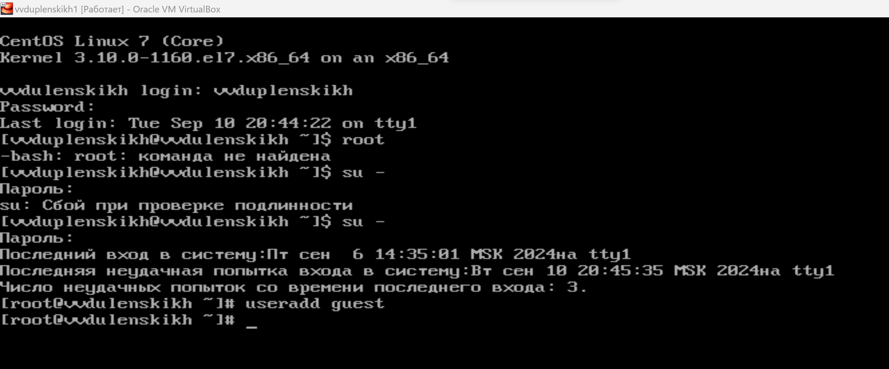
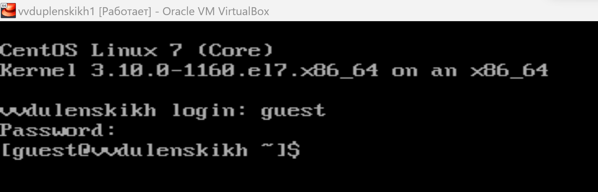
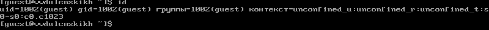
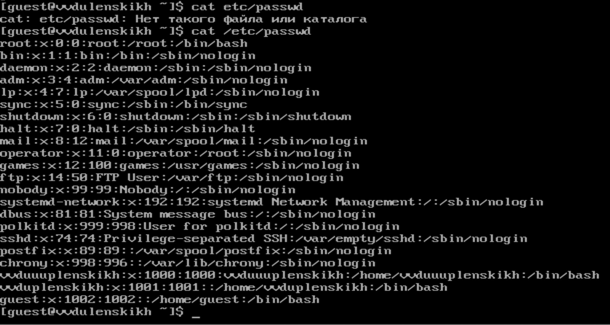
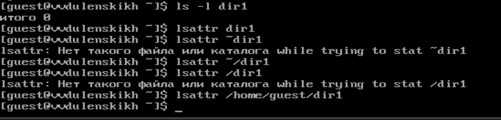
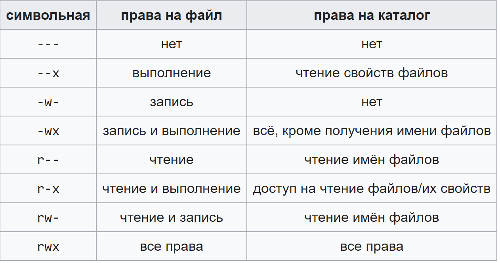

### РОССИЙСКИЙ УНИВЕРСИТЕТ ДРУЖБЫ НАРОДОВ
#### Факультет физико-математических и естественных наук  
#### Кафедра математического моделирования и искусственного интеллекта 
## ОТЧЕТ ПО ЛАБОРАТОРНОЙ РАБОТЕ № 2
#### Дисциплина: Информационная безопасность
##### Студент:  Дупленских Василий Викторович
##### Группа:   НБИбд-01-21
## Москва 2024
***

### Задание:
Получение практических навыков работы в консоли с атрибутами файлов, закрепление теоретических основ дискреционного разграничения доступа в современных системах с открытым кодом на базе ОС Linux.

### Ход выполнения:
1. Я авторизовался под админской учётной записью. получил рут права и добавил новую учётную запись.
2. Я задал пароль для учётной записи guest используя учётную запись администратора.
3. Вошёл в систему от имени пользователя guest.
4. Определяю директорию в которой нахожусь. `Т.к. Она меня абсолютно устраивает,  я её не меняю.!`[alt text](Картинки/4.png)
5. Уточняю имя пользователя командой "Ктоя?"
6. Уточняю имя пользователя, группу, а также группы, куда входит пользователь, командой id. Выведенные значения uid, gid и др. запоминаю. Сравниваю вывод id с выводом команды groups. -`Вывод сильно отличается.`
7. Сравниваю полученную информацию об имени пользователя с данными,
выводимыми в приглашении командной строки.
8. Смотрю файл /etc/passwd командой
cat /etc/passwd
Ищу в нём свою учётную запись. Определяю uid пользователя.
Определяю gid пользователя. Сравниваю найденные значения с полученными в предыдущих пунктах - `они одинаковы.` 
9. Определяю существующие в системе директории командой
ls -l /home/  
Удалось ли вам получить список поддиректорий директории /home? - `Нет!`   Какие права установлены на директориях? -` Только рут пользователю доступно чтение создание изменение, остальные прав не имеют. Проще говоря, 700.`
10. Проверяю, какие расширенные атрибуты установлены на поддиректориях, находящихся в директории /home, командой:
lsattr /home  
Удалось ли вам увидеть расширенные атрибуты директории? - `Да`  
Удалось ли вам увидеть расширенные атрибуты директорий других - `Нет, отказано в доступе`
пользователей?
11. Создаю в домашней директории поддиректорию dir1 командой
mkdir dir1
Определяю командами ls -l и lsattr, какие права доступа и расширенные атрибуты были выставлены на директорию dir1 - `Все атрибуты`

12. Снимаю с директории dir1 все атрибуты командой
chmod 000 dir1
и проверяю правильность выполнения командой
ls -l

13.  Пробую создать в директории dir1 файл file1 командой  
echo "test" > /home/guest/dir1/file1   
Объясните, почему вы получили отказ в выполнении операции по созданию файла? -`Потому что у папки сняты все атрибуты.`  
Оцените, как сообщение об ошибке отразилось на создании файла? -`Никак`  
Проверьте командой
ls -l /home/guest/dir1
действительно ли файл file1 не находится внутри директории dir1 - `Не находится`
14 - 15. Таблица доступа. `Если изучить эту таблицу - там будут ответы на все вопросы. Есть 3 показателя rwx. Если присутствует r - файл можно прочитать, если w - файл можно перезаписать, если x - файл можно открыть.`

### Выводы:
Я получил практические навыки работы в консоли с атрибутами файлов, закрепил теоретические основы дискреционного разграничения доступа в современных системах с открытым кодом на базе ОС Linux.

   

