# Презентация на тему
## Лабораторная работа № 2
### По предмету **Информационная безопасность**

## Задание : Получение практических навыков работы в консоли с атрибутами файлов, закрепление теоретических основ дискреционного разграничения доступа в современных системах с открытым кодом на базе ОС Linux.

## Ход работы:
### 1. Я авторизовался под админской учётной записью. получил рут права и добавил новую учётную запись.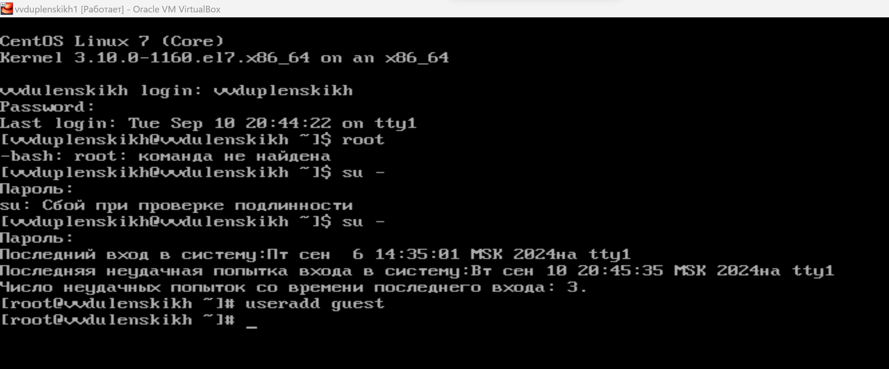
***
### 2. Я задал пароль для учётной записи guest используя учётную запись администратора.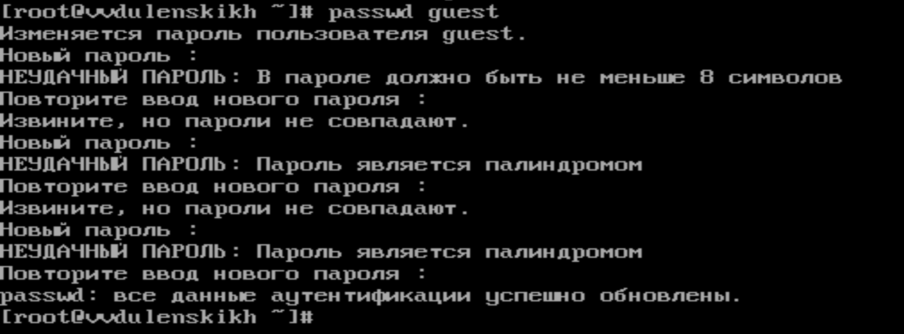

***
### 3. Вошёл в систему от имени пользователя guest.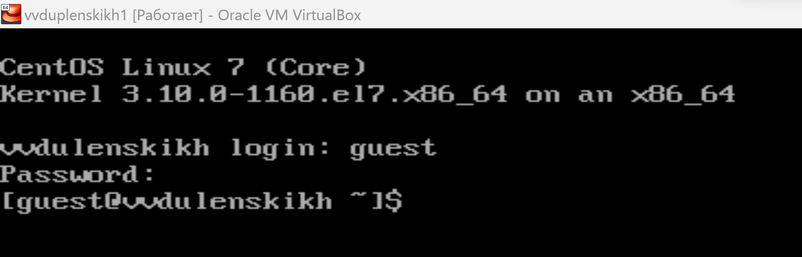
***
### 4. Определяю директорию в которой нахожусь. 
***
### 5. Уточняю имя пользователя командой "Ктоя?"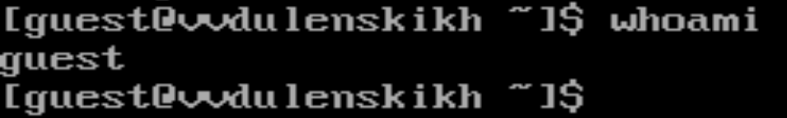
***
### 6. Уточняю имя пользователя, группу, а также группы, куда входит пользователь, командой id.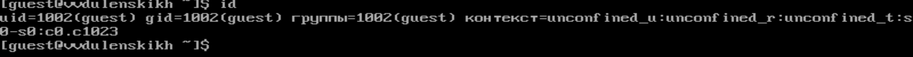
***
### 7. Сравниваю полученную информацию об имени пользователя с данными,выводимыми в приглашении командной строки.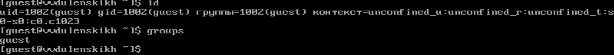
***
### 8. Cмотрю файл /etc/passwd 
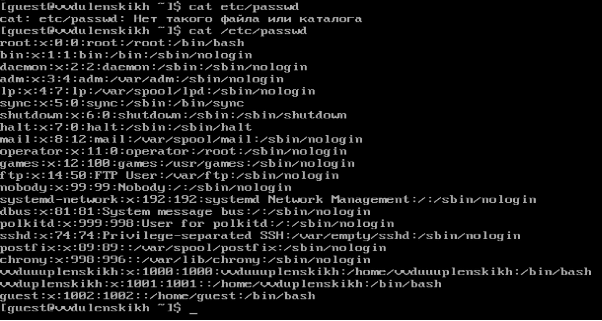
***
### 9. Определяю существующие в системе директории 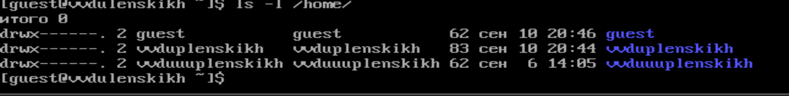
***
### 10. Проверяю, какие расширенные атрибуты установлены на поддиректориях, находящихся в директории /home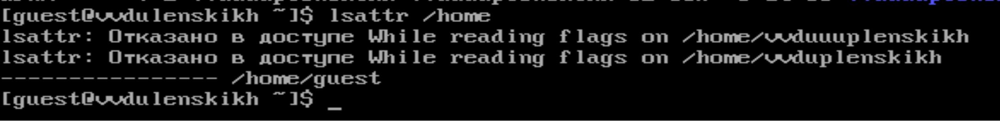
***
### 11. Создаю в домашней директории поддиректорию dir1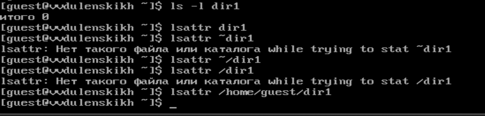
***
### 12. Снимаю с директории dir1 все атрибуты 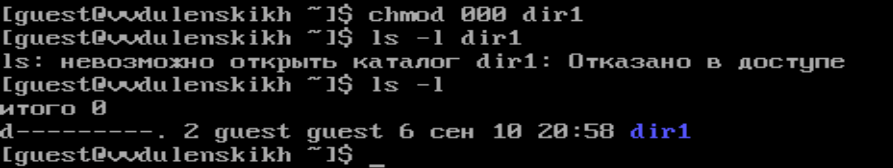
***
### 13. Пробую создать в директории dir1 файл file1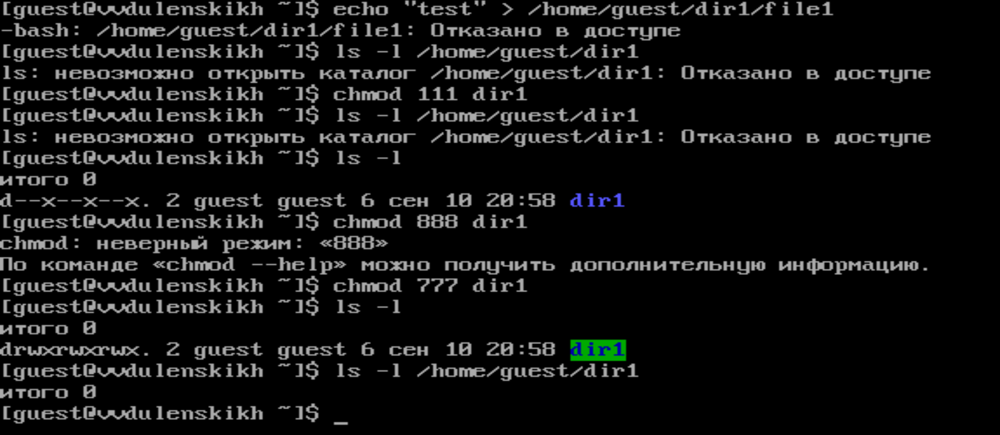
***
### 14. Таблица доступа.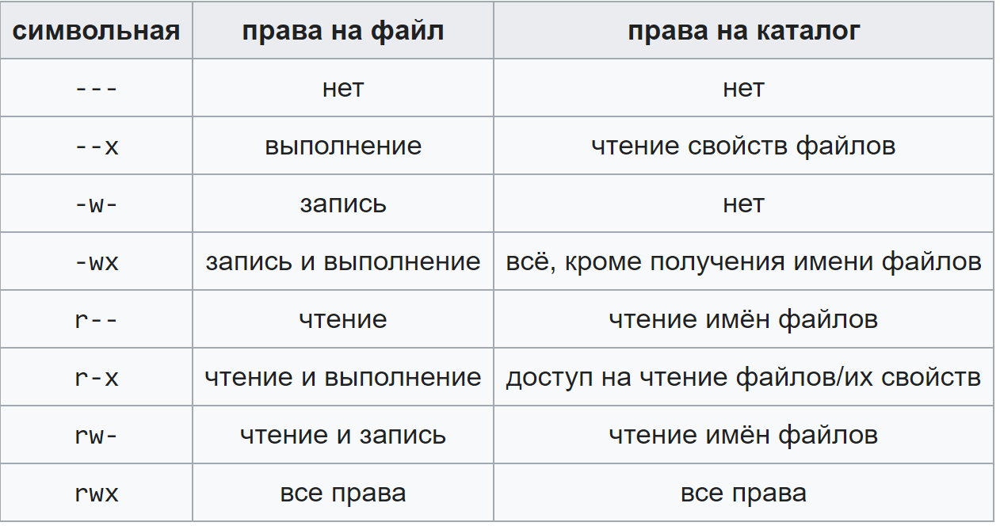
***

## Выводы: Я получил практические навыки работы в консоли с атрибутами файлов, закрепил теоретические основы дискреционного разграничения доступа в современных системах с открытым кодом на базе ОС Linux.
# Спасибо за внимание!