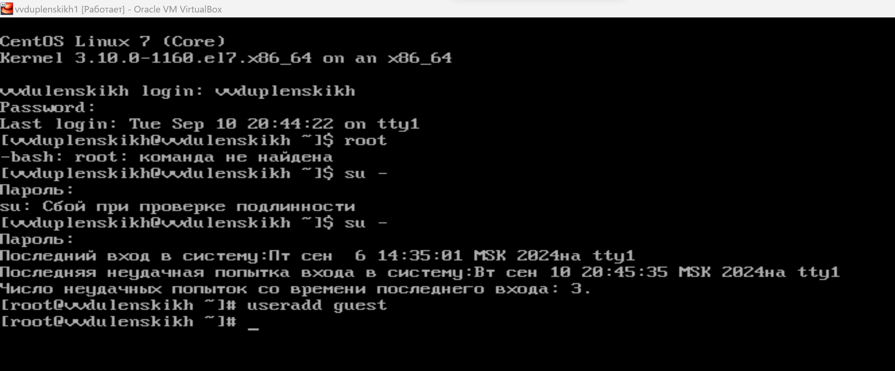
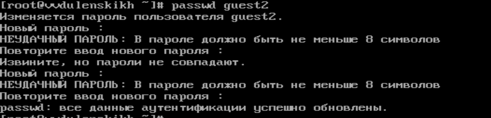
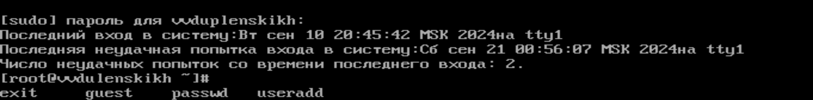
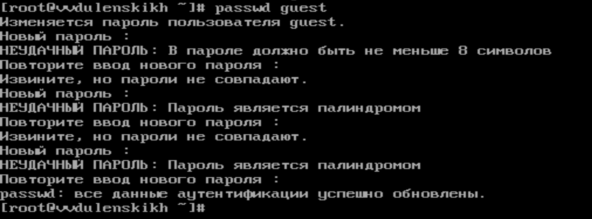
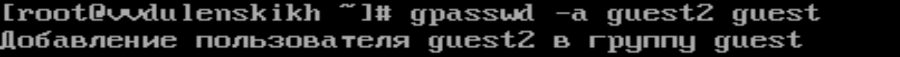
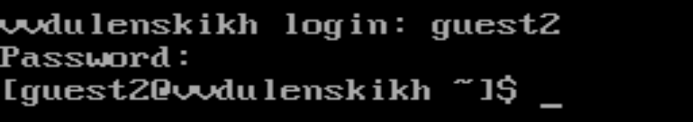
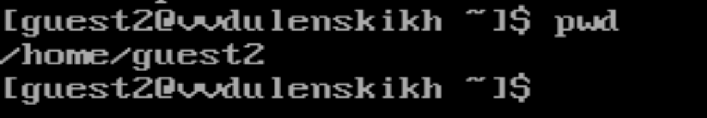
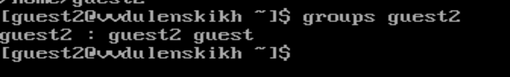
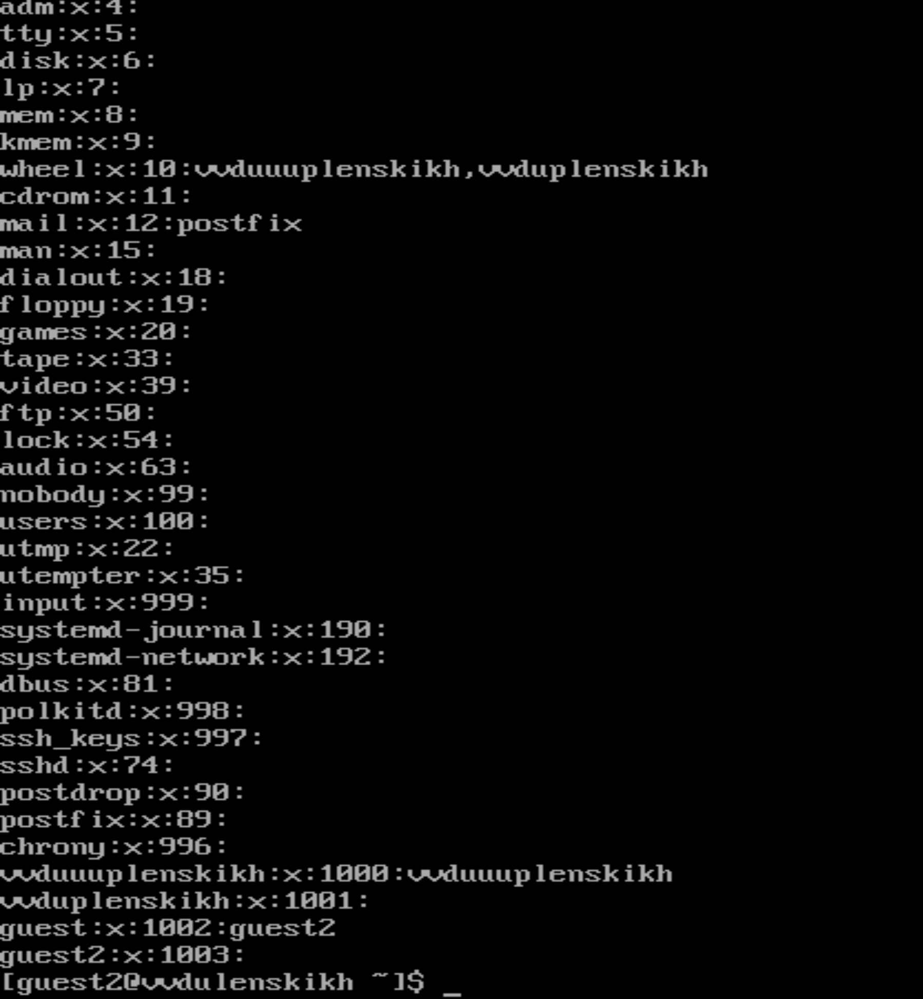
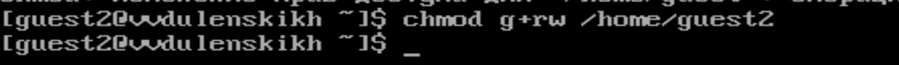

### РОССИЙСКИЙ УНИВЕРСИТЕТ ДРУЖБЫ НАРОДОВ
#### Факультет физико-математических и естественных наук  
#### Кафедра математического моделирования и искусственного интеллекта 
## ОТЧЕТ ПО ЛАБОРАТОРНОЙ РАБОТЕ № 3
#### Дисциплина: Информационная безопасность
##### Студент:  Дупленских Василий Викторович
##### Группа:   НБИбд-01-21
## Москва 2024
***

### Задание:
Получение практических навыков работы в консоли с атрибутами файлов для групп пользователей.

### Ход выполнения:
1. В установленной операционной системе создайте учётную запись пользователя guest (использую учётную запись администратора) 
2. Задайте пароль для пользователя guest (использую учётную запись администратора): 

3. Аналогично создайте второго пользователя guest2.  
4. Добавьте пользователя guest2 в группу guest: 
5. Осуществите вход в систему от двух пользователей на двух разных консолях: guest на первой консоли и guest2 на второй консоли. 
6. Для обоих пользователей командой pwd определите директорию, в которой вы находитесь. Сравните её с приглашениями командной строки 
7. Уточните имя вашего пользователя, его группу, кто входит в неё
и к каким группам принадлежит он сам. Определите командами
groups guest и groups guest2, в какие группы входят пользователи guest и guest2. Сравните вывод команды groups с выводом команд id -Gn и id -G.  
8. Сравните полученную информацию с содержимым файла /etc/group.
Просмотрите файл командой cat /etc/group 
9. От имени пользователя guest2 выполните регистрацию пользователя
guest2 в группе guest командой newgrp guest 
10. От имени пользователя guest измените права директории /home/guest,
разрешив все действия для пользователей группы: chmod g+rwx /home/guest 
11. От имени пользователя guest снимите с директории /home/guest/dir1
все атрибуты командой chmod 000 dirl 

### Выводы:
Я получил практические навыки работы в консоли с атрибутами файлов для групп пользователей.

