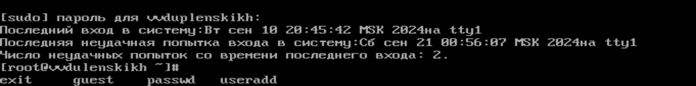
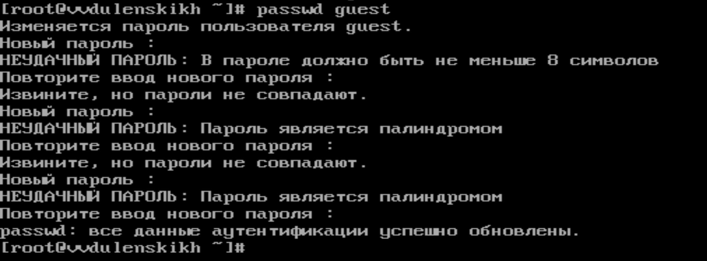
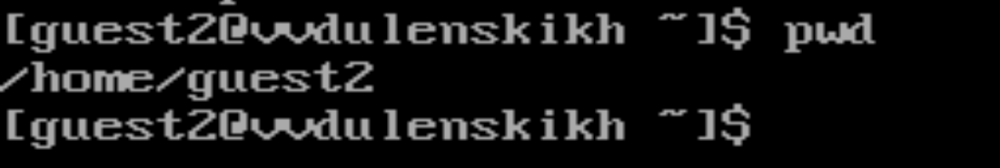
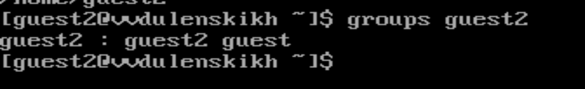
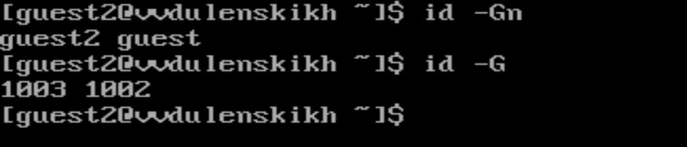

# Презентация на тему
## Лабораторная работа № 3
### По предмету **Информационная безопасность**

## Задание : Получение практических навыков работы в консоли с атрибутами файлов для групп пользователей.

## Ход работы:
### 1. Cоздайте учётную запись пользователя guest 
***
### 2. Задайте пароль для пользователя guest  

***
### 3. Аналогично создайте второго пользователя guest2.  
***
### 4. Добавьте пользователя guest2 в группу guest: 
***
### 5. Осуществите вход в систему от двух пользователей на двух разных консолях 
***
### 6. Для обоих пользователей командой pwd определите директорию, в которой вы находитесь. 
***
### 7. Уточните имя вашего пользователя, его группу, кто входит в неё и к каким группам принадлежит он сам.  
***
### 8. Сравните полученную информацию с содержимым файла /etc/group.
 
***
### 9. Выполните регистрацию пользователя guest2 в группе guest 
***
### 10. От имени пользователя guest измените права директории /home/guest,
 
***
### 11. От имени пользователя guest снимите с директории /home/guest/dir1 все атрибуты 
***

## Выводы: Я получил практические навыки работы в консоли с атрибутами файлов для групп пользователей.
# Спасибо за внимание!