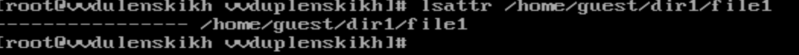
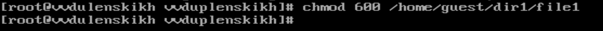
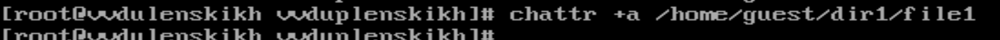
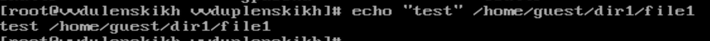
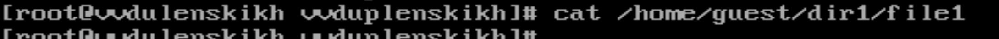
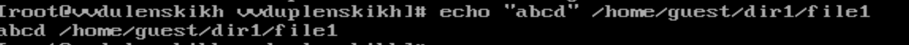
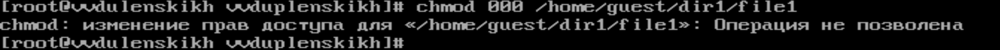
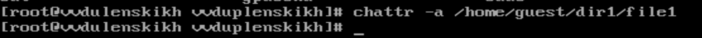
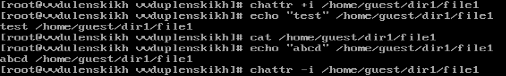

### РОССИЙСКИЙ УНИВЕРСИТЕТ ДРУЖБЫ НАРОДОВ
#### Факультет физико-математических и естественных наук  
#### Кафедра математического моделирования и искусственного интеллекта 
## ОТЧЕТ ПО ЛАБОРАТОРНОЙ РАБОТЕ № 4
#### Дисциплина: Информационная безопасность
##### Студент:  Дупленских Василий Викторович
##### Группа:   НБИбд-01-21
## Москва 2024
***

### Задание:
Получение практических навыков работы в консоли с расширенными атрибутами файлов.

### Ход выполнения:
1. От имени пользователя guest определите расширенные атрибуты файла
/home/guest/dir1/file1 
2. Установите командой chmod 600 file1 на файл file1 права, разрешающие чтение и запись для владельца файла. 
3. Попробуйте установить на файл /home/guest/dir1/file1 расширенный атрибут a от имени пользователя guest.  
4. Зайдите на третью консоль с правами администратора либо повысьте свои права с помощью команды su. Попробуйте установить расширенный атрибут a на файл /home/guest/dir1/file1 от имени суперпользователя:
 
5. От пользователя guest проверьте правильность установления атрибута 
6. Выполните дозапись в файл file1 слова «test» командой 
7. Попробуйте удалить файл file1 либо стереть имеющуюся в нём информацию командой 
8. Попробуйте с помощью команды chmod 000 file1 установить на файл file1 права, например, запрещающие чтение и запись для владельца файла 
9. Снимите расширенный атрибут a с файла /home/guest/dirl/file1 от имени суперпользователя командой 
    chattr -a /home/guest/dir1/file1 
10. Повторите ваши действия по шагам, заменив атрибут «a» атрибутом «i».
Удалось ли вам дозаписать информацию в файл? 

### Выводы:
Я получил практические навыки работы в консоли с расширенными атрибутами файлов..

