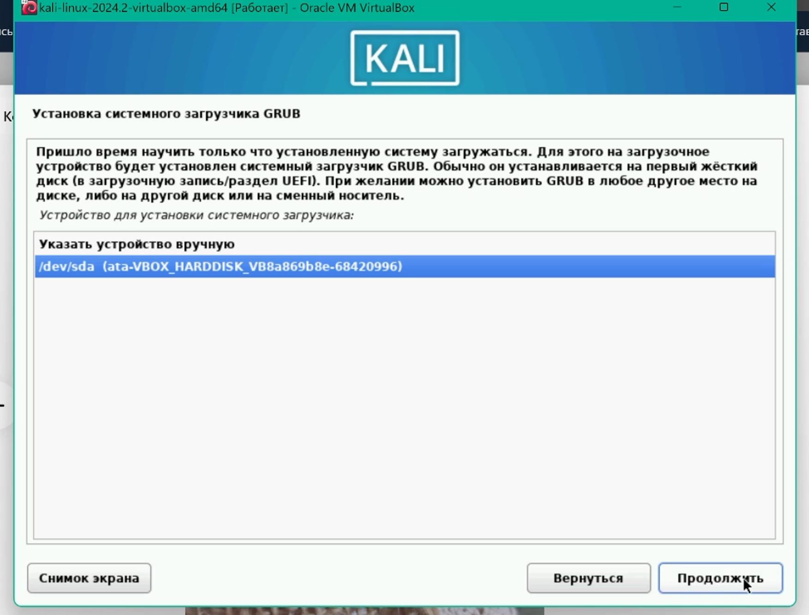

### РОССИЙСКИЙ УНИВЕРСИТЕТ ДРУЖБЫ НАРОДОВ
#### Факультет физико-математических и естественных наук  
#### Кафедра математического моделирования и искусственного интеллекта 
## ОТЧЕТ ПО ПРОЕКТУ ЭТАП № 1
#### Дисциплина: Информационная безопасность
##### Студент:  Дупленских Василий Викторович
##### Группа:   НБИбд-01-21
## Москва 2024
***

### Задание:
Создать Виртуальную машину и на неё установить Kali linux

### Ход работы:
1. Я скачал и открыл файл настроенной виртуальной машины под KALI linux
2. Я добавил образ системы в виртуальную машину, чтобы с него загрузить систему
3. Я запустил систему и установщик.
4. Я задал все языковые параметры системы
5. Я задал все параметры, связанные с именованием: название хоста, устройства, учётной записи согласно соглашению о именовании
6. Я добавил пароль учётной записи
7. Я настроил параметры разметки дисков: куда будет установлена система, на сколько разделов будет разбит диск - везде выбрал "автоматически"
8. Я решил проблему с установкой: не хватало памяти на диске D и я удалил файлы - всё заработало!!! 
9. Я выбрал куда установить загрузчик GRUB
10. Программа завершила установку системы и я вошёл в неё под своими данными, заданными на этапе установки

### Выводы:
Я получил практические навыки по установке и настройке Kali linux на виртуальной машине VirtualBox
