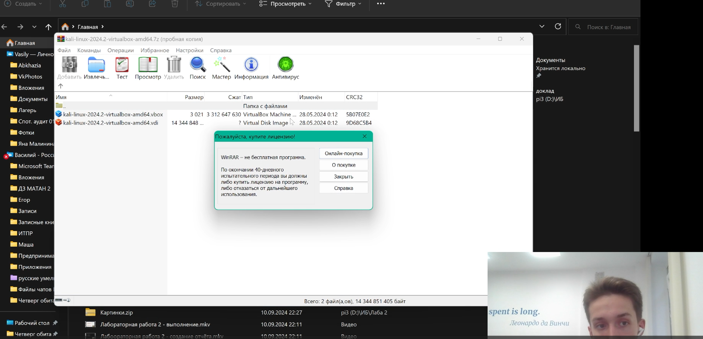
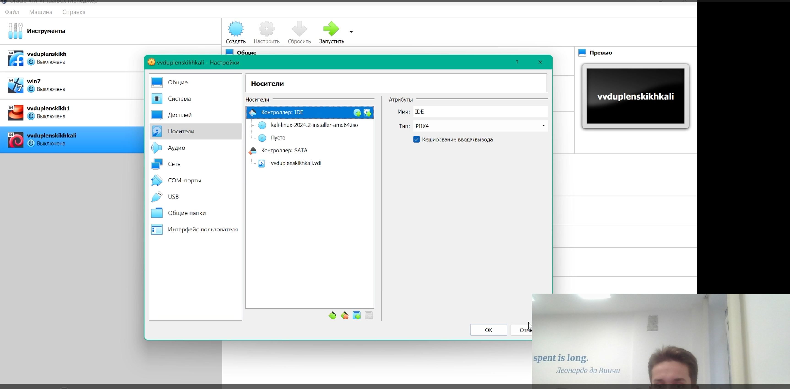
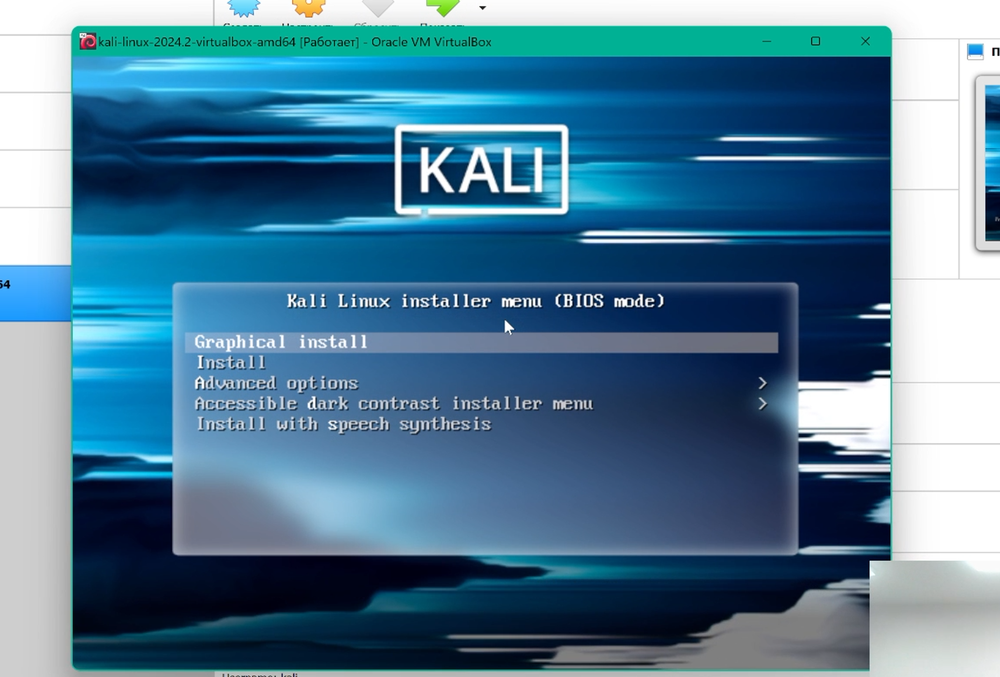
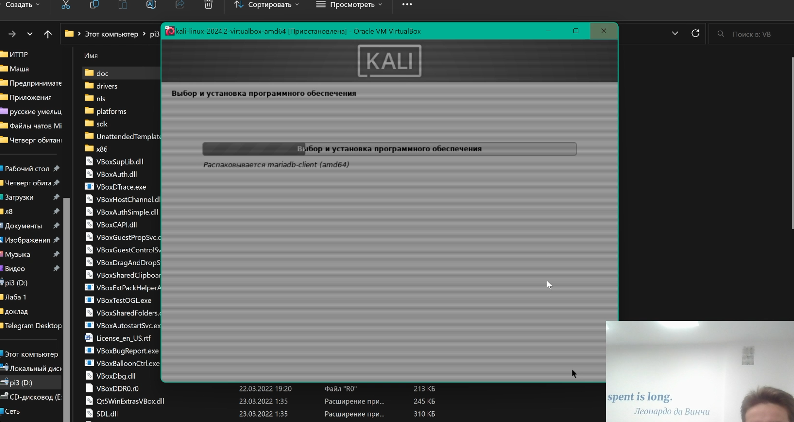
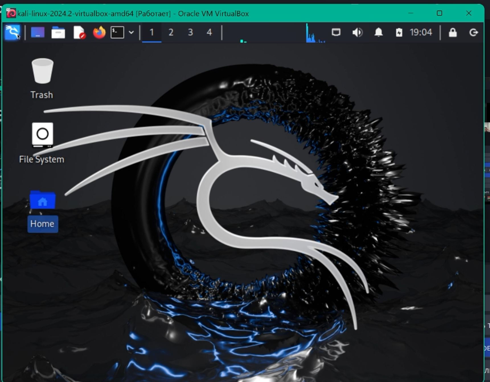

# Презентация на тему
## ОТЧЕТ ПО ПРОЕКТУ ЭТАП № 1
### По предмету **Информационная безопасность**

## Задание : Создать Виртуальную машину и на неё установить Kali linux

## Ход работы:
### 1. Скачивание и открытие файла настроенной виртуальной машины под KALI linux
***
### 2. Добавление образа системы в виртуальную машину, чтобы с него загрузить систему

***
### 3. Запуск системы и установщика.
***
### 4. Установка всех языковых параметров системы
***
### 5.  Установка всех параметров, связанных с именованием: название хоста, устройства, учётной записи согласно соглашению о именовании

***
### 6. Добавление пароля учётной записи

***
### 7. Настройка параметров разметки дисков

***
### 8. Решение проблемы с установкой
 
***
### 9. Выбор места установки загрузчика GRUB
***
### 10. Звершение работы установщика и первый вход в систему
***

## Выводы:   
Я получил практические навыки по установке и настройке Kali linux на виртуальной машине VirtualBox