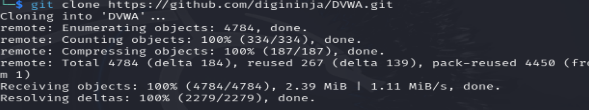
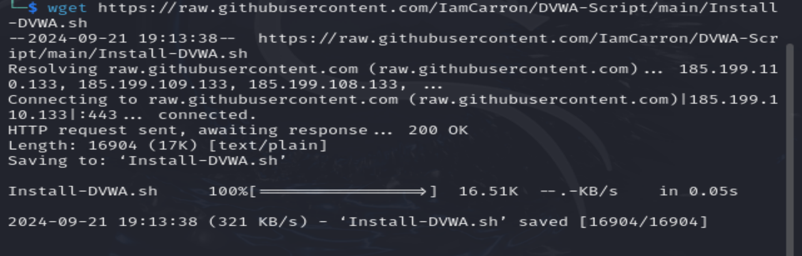
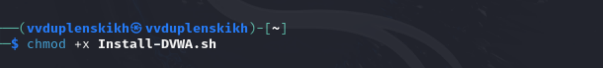
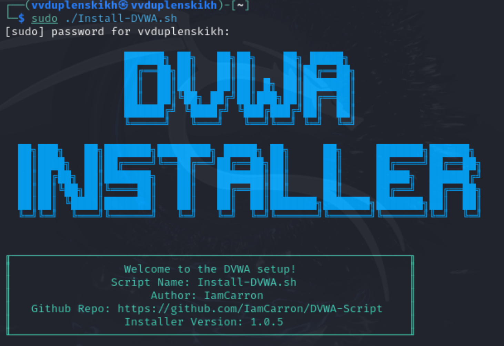
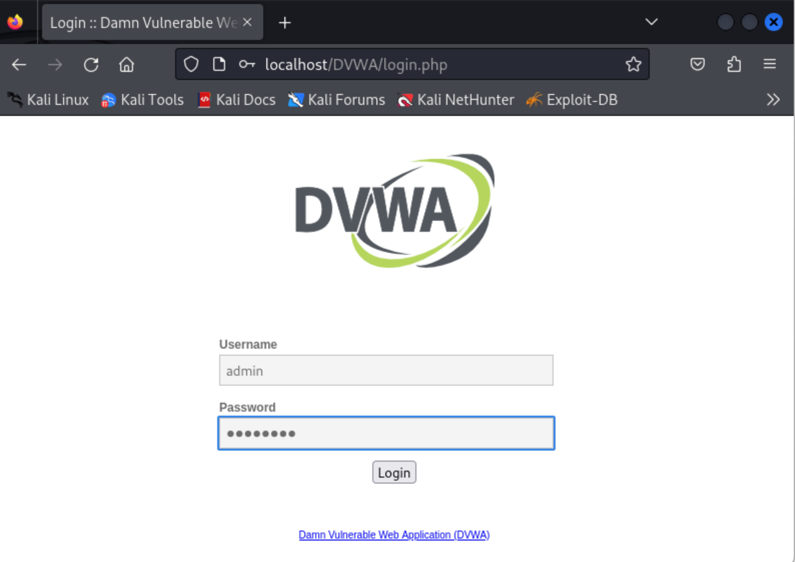
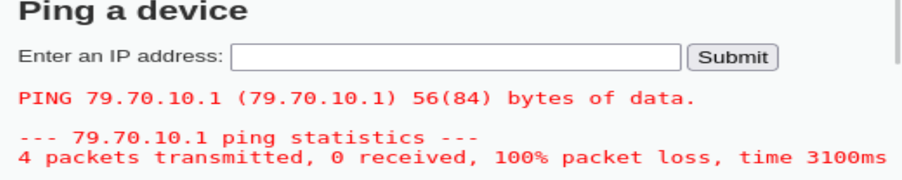
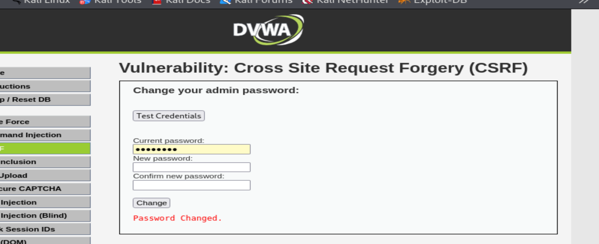

### РОССИЙСКИЙ УНИВЕРСИТЕТ ДРУЖБЫ НАРОДОВ
#### Факультет физико-математических и естественных наук  
#### Кафедра математического моделирования и искусственного интеллекта 
## ОТЧЕТ ПО ПРОЕКТУ ЭТАП № 2
#### Дисциплина: Информационная безопасность
##### Студент:  Дупленских Василий Викторович
##### Группа:   НБИбд-01-21
## Москва 2024
***

### Задание:
Установить DVWA в гостевую систему к Kali Linux.

### Ход работы:
1. Я скачал папку репозиторий DVWA с гитхаба 
2. Я скачал скрипт установки DVWA 
3. Я изменил атрибут запуска скрипта 
4. Я запустил скрипт установки 
5. Я зашёл в DVWA под своим логином и паролем 
6. Я немного поигрался с функциями DVWA: попинговал сервера 
7. Воспользовался функцией CSRF 

### Выводы:
Я получил практические навыки по установке, настройке и использованию приложения DVWA в Kali linux на виртуальной машине VirtualBox
