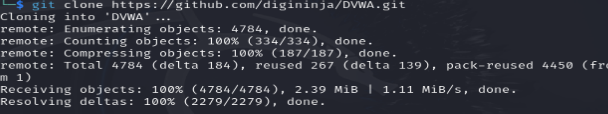
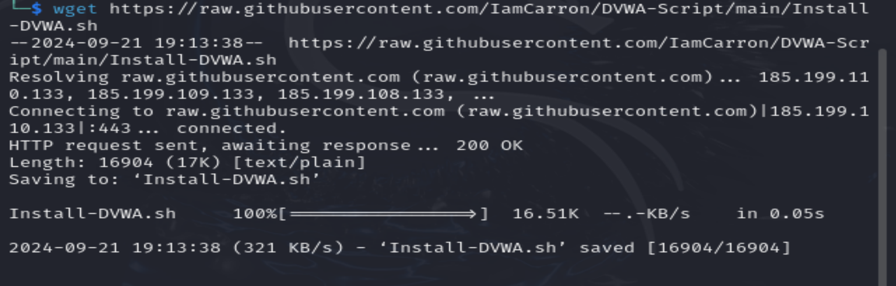
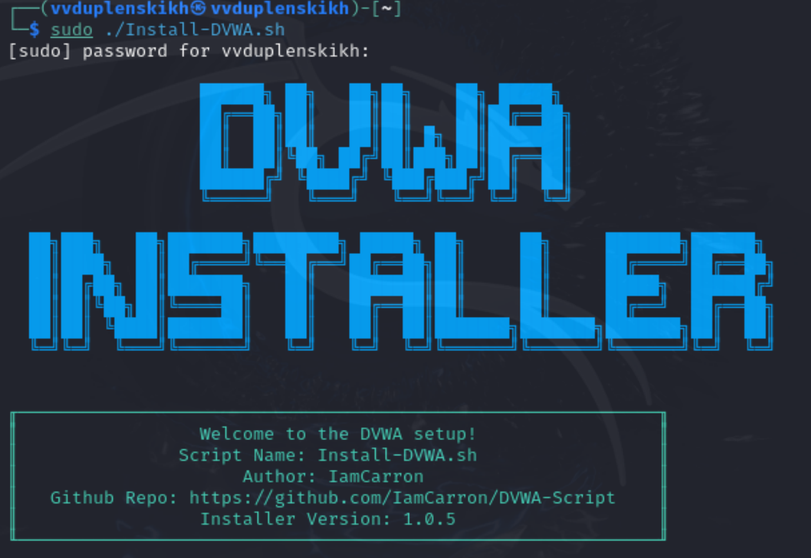
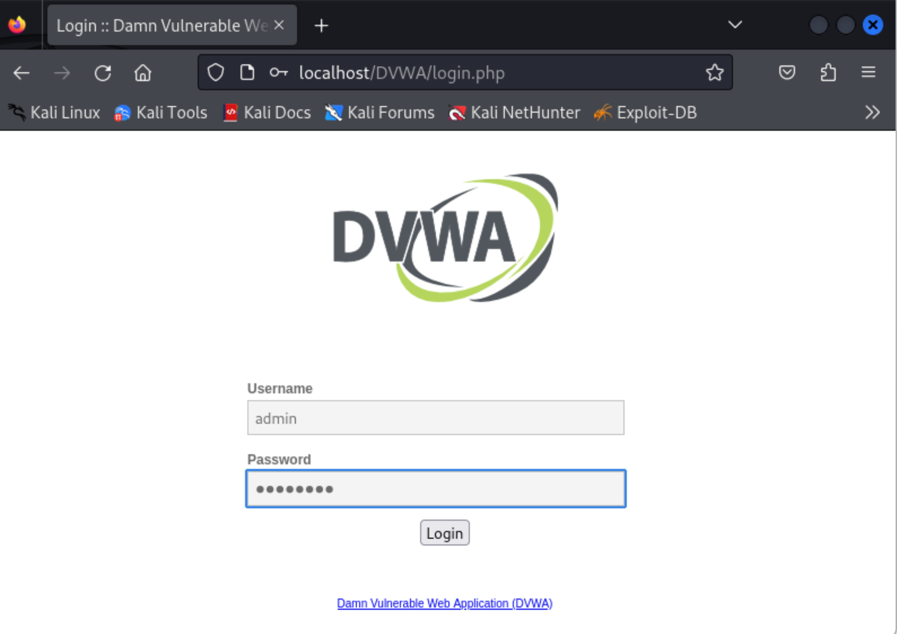
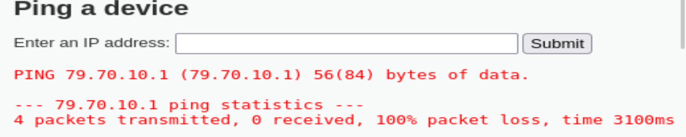
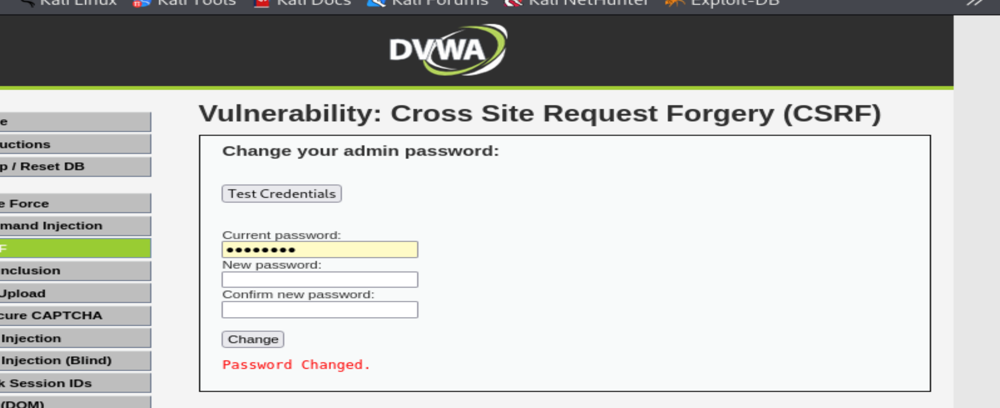

# Презентация на тему
## ОТЧЕТ ПО ПРОЕКТУ ЭТАП № 1
### По предмету **Информационная безопасность**

## Задание : Установить DVWA в гостевую систему к Kali Linux.

## Ход работы:
### 1. Я скачал папку репозиторий DVWA с гитхаба 
***
### 2. Добавление образа системы в виртуальную машину, чтобы с него загрузить системуЯ скачал скрипт установки DVWA 

***
### 3. Я изменил атрибут запуска скрипта 
***
### 4. Я запустил скрипт установки 
***
### 5.  Я зашёл в DVWA под своим логином и паролем 
***
### 6. Я немного поигрался с функциями DVWA: попинговал сервера 
***
### 7. Воспользовался функцией CSRF 
***

## Выводы:   
Я получил практические навыки по установке, настройке и использованию приложения DVWA в Kali linux на виртуальной машине VirtualBox
