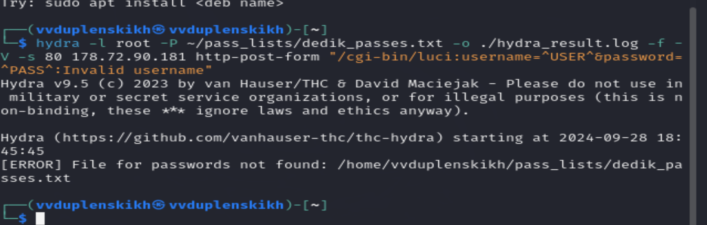

### РОССИЙСКИЙ УНИВЕРСИТЕТ ДРУЖБЫ НАРОДОВ
#### Факультет физико-математических и естественных наук  
#### Кафедра математического моделирования и искусственного интеллекта 
## ОТЧЕТ ПО ПРОЕКТУ ЭТАП № 3
#### Дисциплина: Информационная безопасность
##### Студент:  Дупленских Василий Викторович
##### Группа:   НБИбд-01-21
## Москва 2024
***

### Задание:
Использование Hydra

### Ход работы:
1. Пример работы:
Исходные данные:
IP сервера 178.72.90.181;
Сервис http на стандартном 80 порту;
Для авторизации используется html форма, которая отправляет по адресу http://178.72.90.181/cgi-bin/luci методом POST запрос вида username=root&password=test_password;
В случае не удачной аутентификации пользователь наблюдает сообщение Invalid username and/or password! Please try again.
Запрос к Hydra будет выглядеть примерно так:

hydra -l root -P ~/pass_lists/dedik_passes.txt -o ./hydra_result.log -f -V -s 80 178.72.90.181 http-post-form "/cgi-bin/luci:username=^USER^&password=^PASS^:Invalid username"
Используется http-post-form потому, что авторизация происходит по http методом post.
После указания этого модуля идёт строка /cgi-bin/luci:username=^USER^&password=^PASS^:Invalid username, у которой через двоеточие (:) указывается:
путь до скрипта, который обрабатывает процесс аутентификации (/cgi-bin/luci);
строка, которая передаётся методом POST, в которой логин и пароль заменены на ^USER^ и ^PASS^ соответственно (username=^USER^&password=^PASS^);
строка, которая присутствует на странице при неудачной аутентификации; при её отсутствии Hydra поймёт, что мы успешно вошли (Invalid username).
2. Моя работа: 

### Выводы:
Я получил практические навыки по использованию приложения Hydra в Kali linux на виртуальной машине VirtualBox
