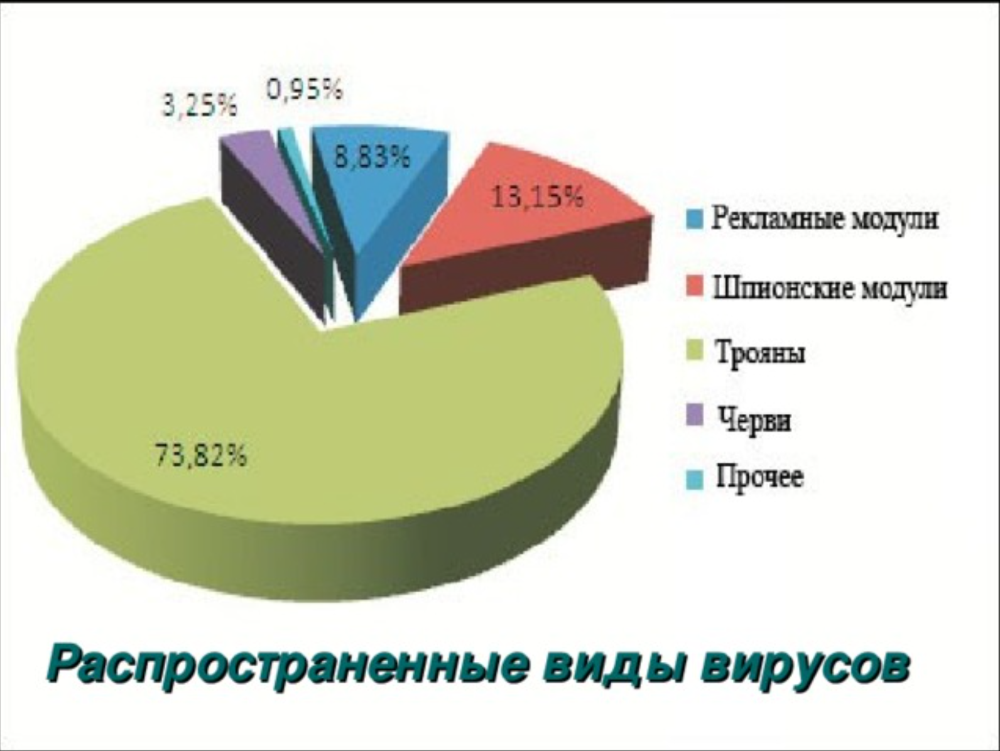

---
## Front matter
marp: true
lang: ru-RU
title: Презентация на тему
subtitle: Вредоносные программы. Троянские программы.
author: |
	 Дупленских Василий Викторович\inst{1}

institute: |
	\inst{1}Российский Университет Дружбы Народов

date: 12 сентября, 2024, Москва, Россия

---

# Российский университет дружбы народов

Реферат на тему:  
**Вредоносные программы. Троянские программы.**
  

Подготовил студент: *НБИбд-01-21*  
**Дупленских Василий**

Москва 2024 г.
***
# 1. Введение

***
# 2. Троянские программы. Определение и характеристики.

***
# 3. Троянские программы. Примеры известных троянских программ

***
# 4. Троянские программы. Методы обнаружения и удаления

***
# 5. Законодательная и правовая основа борьбы с вредоносными программами

***
# 6. Международные и национальные законы о киберпреступности

***
# 7. Заключение

***
# Cпасибо за внимание
